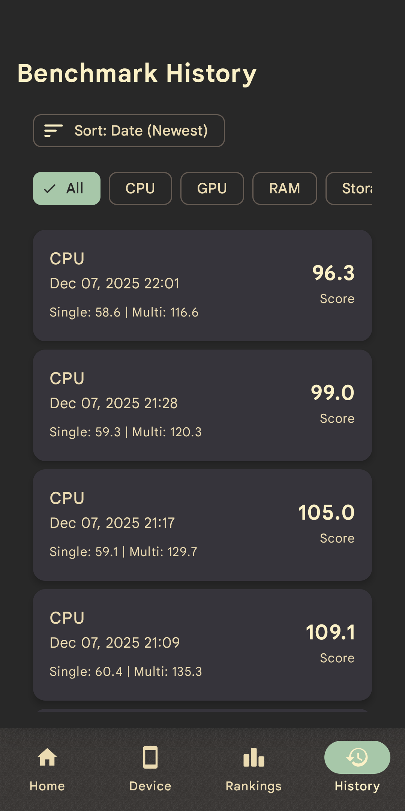
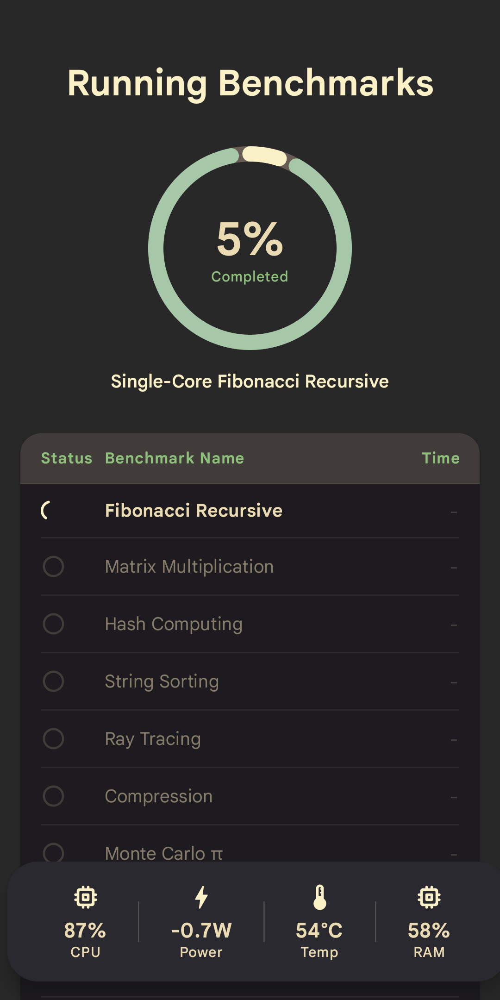

<div align="center">

<!-- Logo with gradient effect simulation -->


# ⚡ FinalBenchmark 2

### *The Ultimate Android Benchmarking Experience*

<br/>

<!-- Download Badges -->
<a href="https://play.google.com/store/apps/details?id=com.ivarna.finalbenchmark2">
  
</a>
<a href="https://f-droid.org/packages/com.ivarna.finalbenchmark2">
  
</a>
<a href="https://github.com/abhay-byte/finalbenchmark-platform/releases/latest">
  
</a>

<br/><br/>

<!-- Stats Row -->
[](https://github.com/abhay-byte/finalbenchmark-platform/releases)
[](https://github.com/abhay-byte/finalbenchmark-platform/stargazers)
[](LICENSE)
[](https://opensource.org/)

<br/>

<!-- Play Store Badges -->


<br/>

---

### 📱 A comprehensive Android CPU benchmarking application<br/>with detailed scoring and visualization

<sub>🚧 GPU, RAM, and Storage benchmarks coming soon</sub>

</div>

<br/>

## 📸 Screenshots

<div align="center">

<table>
  <tr>
    <td></td>
    <td></td>
    <td></td>
    <td></td>
    <td></td>
  </tr>
</table>

</div>

<br/>

## ✨ Features

<table>
<tr>
<td width="50%">

### ✅ **Currently Implemented**
- 🔥 **Comprehensive CPU Benchmarking**
  - Integer & floating-point operations
  - Multi-core performance testing
  - Compression algorithms
  - Cryptographic operations
- 📊 **Smart Scoring System**
  - Normalized single-core scores
  - Multi-core performance ratings
- 📈 **Results History** — Track your device over time
- 🏆 **Rankings** — Compare with popular devices
- 📤 **Export** — JSON, CSV, or text formats
- 🎨 **Modern UI** — Material Design 3
- 🌡️ **Thermal Management** — Prevents overheating

</td>
<td width="50%">

### 🔜 **Coming Soon**
- 🤖 **AI/ML Benchmarking**
  - LLM inference
  - Image classification
  - Object detection
  - Text embedding
  - Speech-to-text
- 🎮 **GPU Benchmarking**
  - Rendering performance
  - Compute operations
  - Memory bandwidth
- 💾 **RAM Benchmarking**
- 💿 **Storage Benchmarking**
- ⚡ **Productivity Tests**

</td>
</tr>
</table>

<br/>

## 🧪 CPU Benchmark Tests

All tests run in both **Single-Core** and **Multi-Core** modes:

<div align="center">

| Test | Description |
|:----:|:------------|
| 🔢 **Prime Generation** | Mathematical computation |
| 🔄 **Fibonacci Iterative** | Algorithm efficiency |
| 📐 **Matrix Multiplication** | Heavy numerical operations |
| 🔐 **Hash Computing** | SHA-256 / MD5 cryptography |
| 📝 **String Sorting** | Memory & sorting algorithms |
| 🌈 **Ray Tracing** | Complex graphics simulation |
| 📦 **Compression (LZMA)** | Real-world workload |
| 🎲 **Monte Carlo** | Statistical computation |
| 📋 **JSON Parsing** | Data processing |
| ♛ **N-Queens** | Backtracking algorithm |

</div>

<br/>

## 🔧 Building from Source

```bash
# Clone the repository
git clone https://github.com/abhay-byte/finalbenchmark-platform.git

# Navigate to project directory
cd finalbenchmark-platform

# Build debug APK
./gradlew assembleDebug
```

<br/>

## 📄 License

```
Copyright 2024 Abhay

Licensed under the Apache License, Version 2.0 (the "License");
you may not use this file except in compliance with the License.
You may obtain a copy of the License at

    http://www.apache.org/licenses/LICENSE-2.0
```

See the [LICENSE](LICENSE) file for complete details.

<br/>

---

<div align="center">

### 💖 Made with love by [Abhay](https://github.com/abhay-byte)

<sub>If you find this app useful, please consider giving it a ⭐</sub>

<br/>

[](https://github.com/abhay-byte)

</div>
